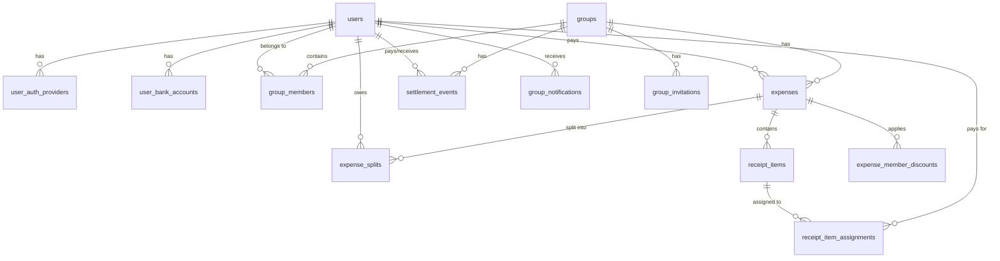

# KWH-Split Database Architecture & Setup

This document serves as the central reference for the application's PostgreSQL database. It includes setup instructions, an Entity-Relationship (ER) diagram, and detailed human-readable tables explaining the schema.

---

## 1. Local Database Setup

### Prerequisites
- PostgreSQL 12+ installed and running
- `psql` command-line tool
- Node.js & `pnpm` installed

### Step 1: Create the Database
Create an empty database named `kwh_split`:
```bash
createdb -U postgres kwh_split
```

### Step 2: Apply Migrations
The database schema is fully managed by our migration runner. Instead of importing a static SQL dump, you must run the migrations to build the schema incrementally:
```bash
cd server
DATABASE_HOST=localhost DATABASE_USER=postgres DATABASE_PASSWORD= DATABASE_PORT=5432 DATABASE_NAME=kwh_split pnpm db:migrate
```

*(Note: The above command overrides the `.env` default to target your local `kwh_split` database).*

---

## 2. Entity-Relationship Diagram



---

## 3. Schema Documentation

### Core Identity & Access

#### `users`
Stores user accounts, profile details, and global discount statuses.
| Column | Type | Constraints | Description |
|--------|------|-------------|-------------|
| `user_id` | Integer | **PK** | Unique identifier |
| `name` | Varchar(255) | Not Null | Display name |
| `email` | Varchar(255) | **Unique**, Not Null | User's email address |
| `password` | Varchar(255) | Not Null | Hashed password |
| `is_active` | Boolean | Default `true` | Soft-delete / account status |
| `avatar_url` | Varchar(500) | | External Avatar URL |
| `profile_image_url`| Text | | Uploaded profile image URL |
| `bank_qr_url` | Text | | QR code image for peer-to-peer payments |
| `discount_type` | Varchar(50) | Default `none` | `none`, `pwd`, or `senior` |
| `email_verified`| Boolean | | Whether email is verified |

#### `user_auth_providers`
Links third-party social logins (like Google) to existing users.
| Column | Type | Constraints | Description |
|--------|------|-------------|-------------|
| `auth_provider_id`| Integer | **PK** | Unique identifier |
| `user_id` | Integer | **FK** (`users`) | The linked user account |
| `provider` | Varchar(30) | Not Null | E.g., `google` |
| `provider_user_id`| Varchar(255) | Not Null | External unique ID from the provider |
| `provider_email` | Varchar(255) | | External email |

#### `user_bank_accounts`
Stores banking details to facilitate external settlements.
| Column | Type | Constraints | Description |
|--------|------|-------------|-------------|
| `bank_account_id` | Integer | **PK** | Unique identifier |
| `user_id` | Integer | **FK** (`users`) | The owner of the bank account |
| `bank_name` | Varchar(255) | Not Null | Name of the bank |
| `account_number` | Varchar(100) | Not Null | The account number |

---

### Groups & Collaboration

#### `groups`
Shared workspaces where users pool expenses.
| Column | Type | Constraints | Description |
|--------|------|-------------|-------------|
| `group_id` | Integer | **PK** | Unique identifier |
| `name` | Varchar(255) | Not Null | Name of the group |
| `description` | Text | | Context / description of the group |
| `currency` | Varchar(10) | Default `USD` | Base currency |
| `invite_token` | Varchar(255) | **Unique** | Public token for invite links |
| `image_url` | Text | | Group cover image |

#### `group_members`
Junction table tracking who belongs to which group and their roles.
| Column | Type | Constraints | Description |
|--------|------|-------------|-------------|
| `member_id` | Integer | **PK** | Unique identifier |
| `group_id` | Integer | **FK** (`groups`) | The target group |
| `user_id` | Integer | **FK** (`users`) | The member |
| `role` | Varchar(50) | Default `member` | E.g., `admin`, `member` |
| `is_active` | Boolean | Default `true` | Handles soft-leaves/deletes |
| `discount_type` | Varchar(50) | Default `none` | Group-specific override (`none`, `pwd`, `senior`) |

#### `group_invitations`
Pending invites sent via email.
| Column | Type | Constraints | Description |
|--------|------|-------------|-------------|
| `invitation_id` | Integer | **PK** | Unique identifier |
| `group_id` | Integer | **FK** (`groups`) | The group being invited to |
| `inviter_user_id` | Integer | **FK** (`users`) | Who sent the invite |
| `invitee_email` | Varchar(255) | Not Null | Email address invited |
| `status` | Varchar(50) | Default `pending` | `pending`, `accepted`, `declined`, `expired`, `left` |
| `invite_token` | Varchar(255) | **Unique** | Secure token for the email link |

#### `group_notifications`
Activity feed events for users (e.g. "User X added an expense").
| Column | Type | Constraints | Description |
|--------|------|-------------|-------------|
| `notification_id` | Integer | **PK** | Unique identifier |
| `user_id` | Integer | **FK** (`users`) | The user receiving the notification |
| `actor_user_id` | Integer | **FK** (`users`) | The user who performed the action |
| `group_id` | Integer | **FK** (`groups`) | The related group context |
| `type` | Varchar(64) | Not Null | E.g. `expense_added`, `member_joined` |
| `title` | Varchar(255) | Not Null | Notification title |
| `message` | Text | Not Null | Notification body content |

---

### Expenses & Receipts

#### `expenses`
A single shared bill or purchase.
| Column | Type | Constraints | Description |
|--------|------|-------------|-------------|
| `expense_id` | Integer | **PK** | Unique identifier |
| `group_id` | Integer | **FK** (`groups`) | The group the expense belongs to |
| `payer_user_id` | Integer | **FK** (`users`) | Who fronted the money |
| `title_description`| Varchar(255) | Not Null | What was purchased |
| `total_amount` | Numeric(10,2) | Not Null | The total bill amount |
| `sale_date` | Date | Not Null | When the purchase happened |
| `tax_amount` | Numeric(10,2) | Default `0.00` | Tax component of the total |
| `tip_amount` | Numeric(10,2) | Default `0.00` | Tip component of the total |
| `split_type` | Varchar(50) | Default `equal`| `equal`, `percentage`, `shares`, `exact`, `itemized` |
| `category` | Varchar(100) | Default `General` | E.g. `Food`, `Transport` |
| `client_expense_uuid`| UUID | **Unique** | Ensures idempotency for offline syncs |

#### `receipt_items`
Extracted line items from a receipt (often via OCR).
| Column | Type | Constraints | Description |
|--------|------|-------------|-------------|
| `item_id` | Integer | **PK** | Unique identifier |
| `expense_id` | Integer | **FK** (`expenses`) | The parent expense |
| `item_name` | Varchar(255) | Not Null | Description of the item |
| `price` | Numeric(10,2) | Not Null | Cost of the item |
| `raw_ocr_text` | Text | | Raw text extracted from TabScanner |
| `ocr_confidence` | Numeric(5,2) | | Confidence score from the OCR engine |

#### `receipt_item_assignments`
Tracks which users are sharing the cost of specific receipt items.
| Column | Type | Constraints | Description |
|--------|------|-------------|-------------|
| `assignment_id` | Integer | **PK** | Unique identifier |
| `item_id` | Integer | **FK** (`receipt_items`) | The specific item |
| `user_id` | Integer | **FK** (`users`) | The user consuming the item |

---

### Splitting & Settlements

#### `expense_splits`
The calculated breakdown of exactly how much each user owes for an expense.
| Column | Type | Constraints | Description |
|--------|------|-------------|-------------|
| `split_id` | Integer | **PK** | Unique identifier |
| `expense_id` | Integer | **FK** (`expenses`) | The parent expense |
| `user_id` | Integer | **FK** (`users`) | The user who owes |
| `amount_owed` | Numeric(10,2) | Not Null | Final calculated debt amount |
| `original_amount` | Numeric(10,2) | | The amount owed before discounts |
| `percentage` | Numeric(5,2) | | If `split_type` was `percentage` |
| `share` | Numeric(10,2) | | If `split_type` was `shares` |
| `is_settled` | Boolean | Default `false` | Whether the debt is paid off |

#### `expense_member_discounts`
Tracks PWD/Senior discounts explicitly applied to an expense.
| Column | Type | Constraints | Description |
|--------|------|-------------|-------------|
| `expense_member_discount_id` | Integer | **PK** | Unique ID |
| `expense_id` | Integer | **FK** (`expenses`) | Parent expense |
| `user_id` | Integer | **FK** (`users`) | Who gets the discount |
| `discount_type`| Varchar(20) | Not Null | `pwd` or `senior` |
| `rate_percent` | Numeric(5,2) | Default `20.00` | The discount rate |

#### `settlement_events`
Records real-world payments made to clear debts between group members.
| Column | Type | Constraints | Description |
|--------|------|-------------|-------------|
| `settlement_event_id` | Integer | **PK** | Unique identifier |
| `group_id` | Integer | **FK** (`groups`) | Group context |
| `from_user_id` | Integer | **FK** (`users`) | Who paid |
| `to_user_id` | Integer | **FK** (`users`) | Who received the money |
| `amount_paid` | Numeric(10,2) | Not Null | Actual money transferred |
| `payment_method` | Varchar(50) | Default `other` | `cash`, `bank`, `wallet` |
| `reference` | Varchar(120) | | Optional transaction ID |
| `status` | Varchar(50) | Default `confirmed`| `pending`, `confirmed` |

---

## 4. Useful Queries

### Check overall group debt
```sql
SELECT u.name, SUM(es.amount_owed) as total_owed
FROM expense_splits es
JOIN users u ON es.user_id = u.user_id
WHERE u.user_id = 1 AND es.is_settled = false
GROUP BY u.user_id, u.name;
```

### View all settled and unsettled splits
```sql
SELECT e.title_description, u.name, es.amount_owed, es.is_settled
FROM expense_splits es
JOIN expenses e ON es.expense_id = e.expense_id
JOIN users u ON es.user_id = u.user_id
WHERE e.group_id = 1;
```
