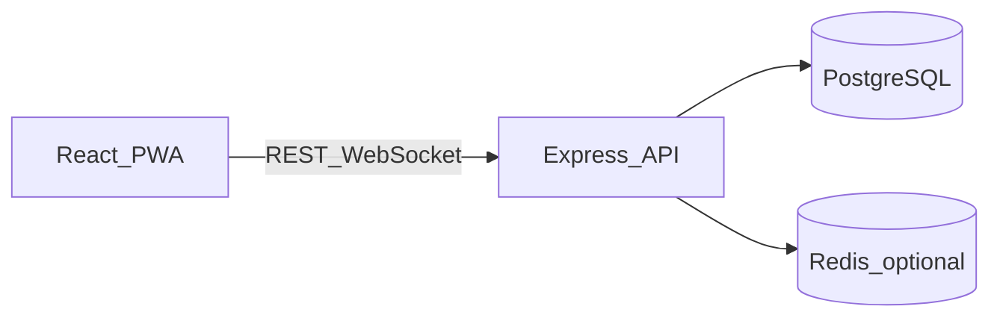

<p align="center">
  
</p>

# Split (kwh-split)

**Split** is a web application for **transparent group expense tracking**—a centralized place to record shared bills, choose how costs are divided, settle up, and stay in sync in real time. It was developed as **CMSC 126 — Final Project** by **Komsai Week Heads** (*KWH — Final Project Proposal, Revised*: course submission PDF describing objectives, schema, UI, and technical design).

Managing shared expenses with notes or chat threads is easy to mess up: wrong math, opaque totals, and awkward follow-ups on who paid whom. Split targets **accuracy**, **visibility**, and **fair splits**—including Philippine **SC/PWD** discount logic where applicable.

---

## Features (aligned with the project proposal)

| Area | Capabilities |
|------|----------------|
| **Authentication** | Email signup/login, JWT sessions, optional Google sign-in |
| **Groups** | Create groups, invite links, membership roles, soft-delete / leave flows |
| **Expense management** | Add, edit, remove expenses; payer selection; receipts; balances |
| **Split methods** | Equal, **percentage**, **shares**, **exact amounts**, and **split by item** (receipt OCR + assign items); tax/tips/service distributed per proposal |
| **SC / PWD (PH)** | Profile flag for eligible members; VAT-exempt + 20% discount applied to **their portion** while others pay standard shares |
| **Settlements** | Track who owes whom; payment flow; upload **wallet / bank QR** on profile for easier payback |
| **Real-time** | **WebSockets** (`ws`): expense and balance updates propagate to connected group members |
| **Client experience** | **React** + **Tailwind**, responsive layout; **PWA** (service worker via Vite)—offline-friendly direction per proposal |

Planned or partial items from the written proposal **may differ in detail** from the codebase (e.g. weekly summary cron design, QR Ph barcode standardization, Lighthouse targets). Infrastructure includes hooks for scheduled work (see [`infra/terraform/lambda.tf`](infra/terraform/lambda.tf)); behavior evolves with the course project.

---

## Objectives (from proposal)

- Centralized shared expense management  
- Real-time synchronization across members  
- Path toward offline-aware usage and sync (PWA + APIs)  
- Automated / scheduled summaries and notifications where implemented  
- Solid performance on desktop and mobile  

---

## Architecture

Classic **client ↔ server**:

1. Users interact with the **React** SPA (`client/`).  
2. REST calls hit **Express** APIs (`server/`) under `/api/…`.  
3. **PostgreSQL** stores users, groups, expenses, splits, receipt items, settlements, etc.  
4. The server maintains **WebSocket** connections per group session and broadcasts changes.  

For **production on AWS** (VPC, RDS, Redis, ECS, CloudFront SPA), see [**infra/README.md**](infra/README.md).



---

## Monorepo layout

| Path | Role |
|------|------|
| [`client/`](client/) | Vite + React + TypeScript SPA |
| [`server/`](server/) | Express API, auth, realtime hub, OCR, migrations |
| [`infra/`](infra/) | Terraform, deploy scripts for static site |
| [`Dockerfile`](Dockerfile) | Multi-stage **`api`** and **`worker`** images for ECS |

---

## Tech stack

| Layer | Choices |
|-------|---------|
| **Frontend** | React 19, TypeScript, Vite, Tailwind CSS 4, TanStack Query, React Router |
| **Backend** | Node.js 20+, Express 5, TypeScript |
| **Real-time** | `ws` (native WebSockets on `/api/realtime`), optional Redis fan-out when configured |
| **Database** | PostgreSQL via `pg` |
| **Auth** | bcrypt, `jose` (JWT), httpOnly cookies |
| **OCR / receipts** | TabScanner integration + Sharp for images (see env and [`infra/README.md`](infra/README.md)) |

---

## Prerequisites

- **Node.js** ≥ 20  
- **[pnpm](https://pnpm.io/)** (see root `packageManager` pin)  
- **PostgreSQL** running locally or reachable from your machine  

---

## Quick start (local development)

Clone and install dependencies from the repo root:

```bash
pnpm install
```

### Database

Create a database for the project, then set environment variables for the server (pattern is in [`server`](server/) `.env.example` / project docs).

Run migrations:

```bash
pnpm db:migrate
```

### Run app

Start API and UI together:

```bash
pnpm dev
```

- Client is served by Vite (see `client` scripts for host/port).  
- API listens on `PORT` (often `4000`); configure CORS / `WEB_ORIGIN` when testing cross-origin setups.

---

## Scripts (root)

| Command | Purpose |
|---------|---------|
| `pnpm dev` | Run client + server dev servers in parallel |
| `pnpm build` | Build all packages |
| `pnpm lint` | Lint workspaces |
| `pnpm typecheck` | TypeScript check |
| `pnpm db:migrate` | Apply SQL migrations (`@split/server`) |
| `pnpm deploy:site` | Build SPA and sync to S3 + invalidate CloudFront (requires Terraform outputs / AWS CLI) |

Server-only: `pnpm --filter @split/server run test`.

---

## Environment configuration

Do **not** commit secrets.

- Local: configure the API with environment variables—the authoritative list and defaults live in [`server/src/config/env.ts`](server/src/config/env.ts).  
- Terraform: **`infra/terraform/terraform.tfvars.example`** → local `terraform.tfvars` for cloud deploys.

---

## Database model (conceptual)

The proposal describes **Users**, **Groups**, **GroupMembers**, **Expenses**, **ExpenseSplits**, **ReceiptItems**, and **ReceiptItemAssignments**—implemented in **`server/src/db/migrations/`** and **`server/schema.sql`** (evolve with the project). Discount flags and audit fields mirror the revised proposal’s emphasis on eligibility and accountability.

---

## API surface

Endpoints are prefixed with **`/api`** (e.g. `/api/auth/login`, `/api/groups`, `/api/expenses`). For exact contracts, read route modules under [`server/src/modules/`](server/src/modules/).

---

## Deployment

- **Static front end + API behind CloudFront:** follow [**infra/README.md**](infra/README.md) (`terraform apply`, ECR images, `pnpm deploy:site`, custom domain notes).  
- **Containers:** [`Dockerfile`](Dockerfile) targets `api` and `worker`; server exports `dist/db/migrate.js` for production migrations.

---